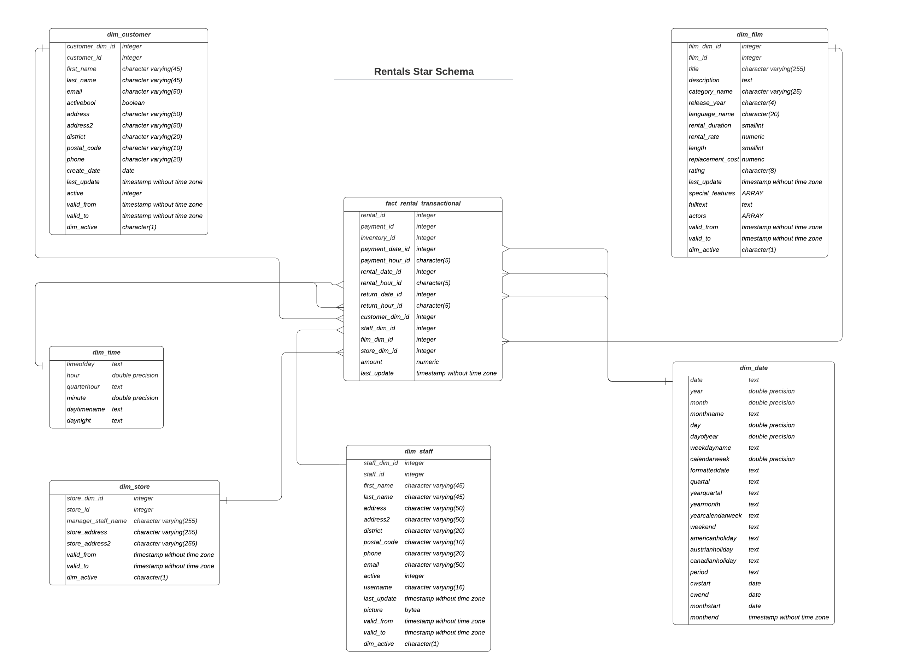

| [Previous](./DWH_Index.md) | [Back to Agenda](./DWH_Index.md)  | [Next](./02-DWH-Dimensions.md) |
| :---------|:----------:|---------: |

# Data Warehouse Fundamentals

## Definition

A **data warehouse** includes data about an entire organization that is used by users at high management levels in order to support strategic decisions.

However, these decisions may also be taken at lower organizational levels related to specific business areas, in which case only a subset of the data contained in a data warehouse is required. This subset is typically contained in a **data mart**. 

## Star Schema

In computing, the **star schema** is the simplest style of data mart schema and is the approach most widely used to develop data warehouses and dimensional data marts. The star schema consists of one or more fact tables referencing any number of dimension tables.

In our business case we wpould try to convert from this [**transactional** model](./img/OLTP-Model.pdf):

into this **dimensional** model:

Image created by author.
 

## The Four Steps for Building a DWH

- Select business process
- Select the grain
- Select dimensions
- Select facts

## Business Process

Let's use the same DVD rental database we have worked in previous sections. 

In this case, the business process would be the rental of DVD's.

## Select the grain

What, exactly, is the grain? The grain of a fact table is the business definition of the measurement event that creates a fact record. The grain is exclusively determined by the **physical realities** of the source of the data.

In this business case, let's imagine the grain as the *beep* that sounds every time a DVD is scanned to be rent.

| [Previous](./DWH_Index.md) | [Back to Agenda](./DWH_Index.md)  | [Next](./02-DWH-Dimensions.md) |
| :---------|:----------:|---------: |
