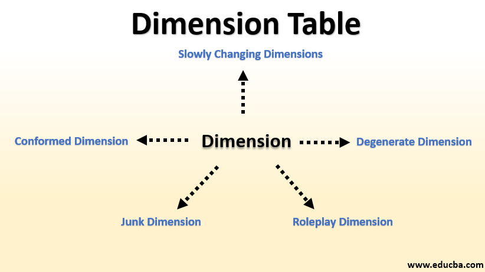

| [Previous](./01-DWH-Concepts.md) | [Back to Agenda](./DWH_Index.md)  | [Next](./03-DWH-Facts.md) |
| :---------|:----------:|---------: |

# Data Warehouse Fundamentals

## The four steps

  - Select business process
  - Select the grain
  - **Select dimensions**
  - Select facts

## Select Dimensions

In data warehousing, a dimension  contains the textual context associated with a business process measurement event. In this context, events are known as "facts".

Dimensions categorize and describe data warehouse facts and measures in ways that support meaningful answers to business questions.  They form the very core of dimensional modeling.  

A data warehouse organizes descriptive attributes as columns in dimension tables. 

Image by "Data Warehouse Etl Toolkit Tutorial". <i>See References for more details</i>.
 

They:

- They describe “who, what, when, how, and why” associated with the event.
- Have fewer rows than fact tables, but can be wide with many large text columns

In this section we will work with the following concepts:

- Surrogate key vs Natural Key
- Slow Changing Dimensions
- Degenerated dimension
- Role Playing Dimension
- Junk Dimension
- Conformed Dimension

Image by "EDUCBA Data Warehouse Tutorial". <i>See References for more details</i>.
 

## Practice with Dimensions

Let's create some dimensions and facts using Python. For this, we will use the node Docker cluster we have worked with in last lessons. Open the [1 - Dimension Types](http://localhost:8888/notebooks/work/1%20-%20Dimension%20Types.ipynb) notebook in the `jupyter-container`

| [Previous](./01-DWH-Concepts.md) | [Back to Agenda](./DWH_Index.md)  | [Next](./03-DWH-Facts.md) |
| :---------|:----------:|---------: |
