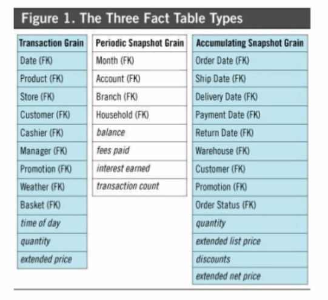

| [Previous](./02-DWH-Dimensions.md) | [Back to Agenda](./DWH_Index.md)  | [Next](./04-DWH-Exercises.md) |
| :---------|:----------:|---------: |

# Data Warehouse Fundamentals

## The four steps

  - Select business process
  - Select the grain
  - Select dimensions
  - **Select facts**

## Select Facts

It is located at the center of a **star schema** or a **snowflake schema** surrounded by dimension tables. Where multiple fact tables are used, these are arranged as a schema.

Fact tables store the performance measurements resulting from an organizations’ business process events.

A Fact represents a business measure. 

Each row in a fact table corresponds to a **measurement event.**

## Measure Types

The numeric measures in a fact table fall into three categories.

- The most flexible and useful facts are fully additive; **additive** measures can be summed across any of the dimensions associated with the fact table.
- **Semi-additive** measures can be summed across some dimensions, but not all; balance amounts are common semi-additive facts because they are additive across all dimensions except time,
- Some measures are completely **non-additive**, such as ratios.

## Fact Table Types


Three types of facts are usually used:

- **Transaction Fact Tables**: A row in a transaction fact table corresponds to a measurement event at a point in space and time. Transaction fact tables help answer the **“how many?”** question. How many rentals we have last month? What were the dollar sales?

```sql
-- run in dvdrental_dwh DB
SELECT rental_id, payment_id, inventory_id, payment_date_id, payment_hour_id, rental_date_id, rental_hour_id, return_date_id, return_hour_id, customer_dim_id, staff_dim_id, film_dim_id, store_dim_id, amount, last_update
FROM public.fact_rental_transactional;
```

rental_id|payment_id|inventory_id|payment_date_id|payment_hour_id|customer_dim_id|staff_dim_id|film_dim_id|store_dim_id|amount
----|---|----|----|----|---|----|----|----|---
1158|17793|1632|20070214|21:21|416|2|1354|102|3
1159|18173|4395|20070214|21:23|516|1|1958|101|5
1160|19399|2795|20070214|21:29|239|2|1612|102|5


- **Periodic Snapshot Fact Tables**: A row in a periodic snapshot fact table summarizes many measurement events occurring **over a standard period, such as a day, a week, or a month**. The grain is the period, not the individual transaction. 


```sql
-- run in dvdrental_dwh DB
-- periodic with semi-additive measure ??
SELECT year_week, film_dim_id, store_dim_id, num_rentals, sum_amount
FROM public.fact_rental_periodic;

```
year_week | film_dim_id | store_dim_id| num_rentals
---------|----------|---------|----
200524|	1001|	102|	2|	2.00
200524|	1003|	101|	1|	3.00
200524|	1004|	101|	2|	6.00
200524|	1005|	101|	2|	9.00


Let's see another example:

```sql
-- run in dvdrental_dwh DB
-- periodic with non-additive measure ??
SELECT year_month, inventory_id, film_dim_id, store_dim_id, rental_days_avg
FROM public.fact_rental_avgtime;

```

year_month |inventory_id | film_dim_id | store_dim_id | rental_days_avg
------|------|-------|-------|-------
20050501|2|1001|101|7
20050501|6|1001|101|4
20050501|14|1003|101|2
20050501|20|1004|101|6

- **Accumulating Snapshot Fact Tables**: A row in an accumulating snapshot fact table summarizes the measurement events occurring atpredictable steps between the beginning and the end of a process. The accumulating snapshot fact table supports the key efficiency measures of velocity.



```sql
-- Can you create this fact?


```

## Use complex structures for Facts in Big Data

In Big Data databases (Big Query, Impala, among others), the columnar format is crucial to get better performance.


<p align="right">
<sub>Image by "What is a Column-Oriented Database". <i>See References for more details</i>.</sub>
<br>
</p>


When performing analytic operations on partially normalized schemas, such as star or snowflake schema in a data warehouse, multiple tables have to be joined to perform the required aggregations. However, JOINs are typically not as performant as denormalized structures. Query performance shows a much steeper decay in the presence of JOINs.

In the `dim_film` table we have one denormalized structure in the fields `fulltext` and `actors`.

```sql
SELECT film_dim_id,fulltext, actors
FROM public.dim_film;

```

This is the content of one actors row:
```
{Penelope Guiness,Christian Gable,Lucille Tracy,Sandra Peck,Johnny Cage,Mena Temple,Warren Nolte,Oprah Kilmer,Rock Dukakis,Mary Keitel}
```

You can store many values as lists, structs, dictionaries to avoid joining another table. In this case, `film_actor`.

With this approach we eliminated the  `film_actor` table in the OLTP model ([check the OLTP diagram](./img/OLTP-Model.pdf)).

| [Previous](./02-DWH-Dimensions.md) | [Back to Agenda](./DWH_Index.md)  | [Next](./04-DWH-Exercises.md) |
| :---------|:----------:|---------: |