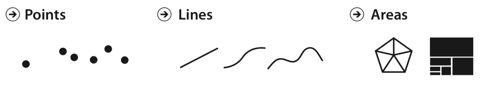
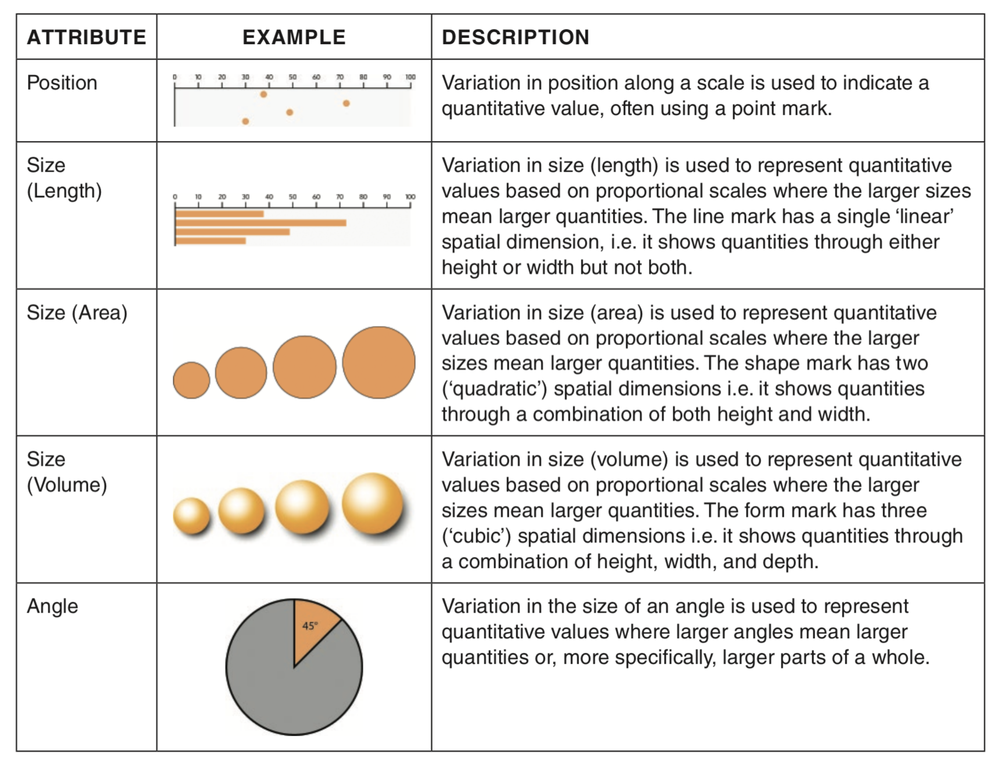
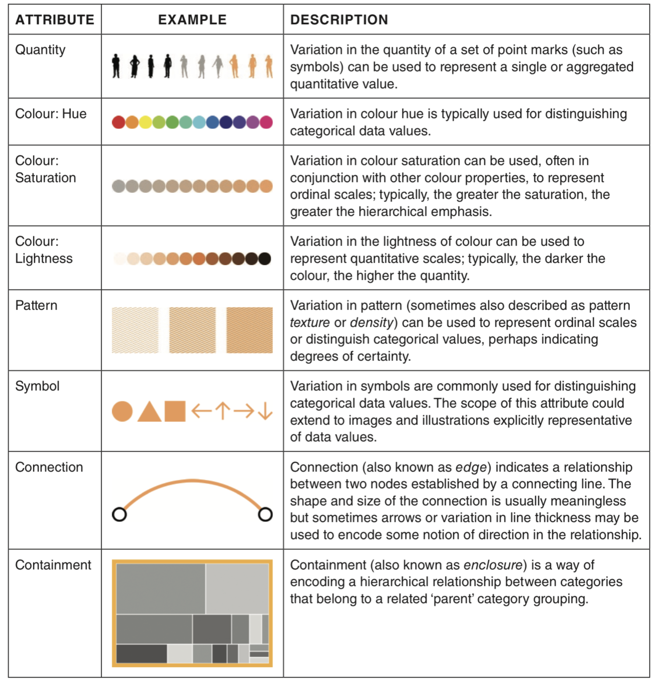
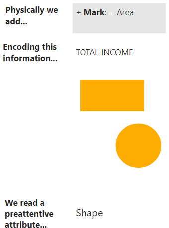
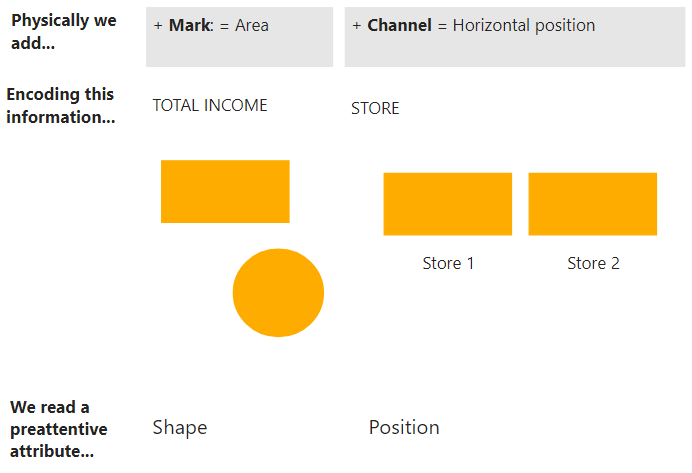
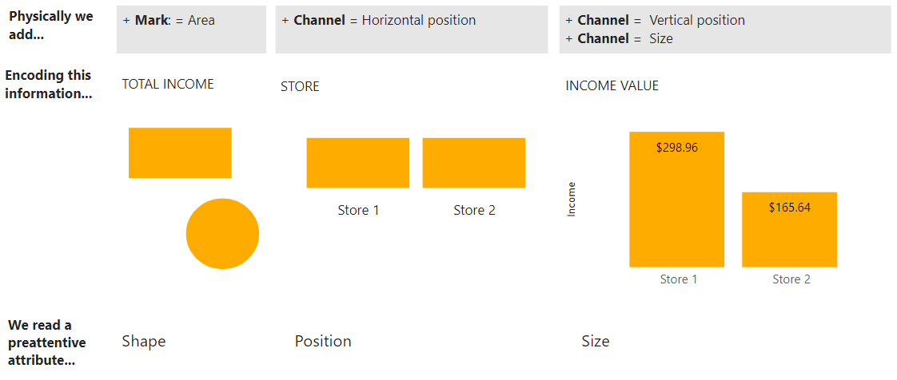
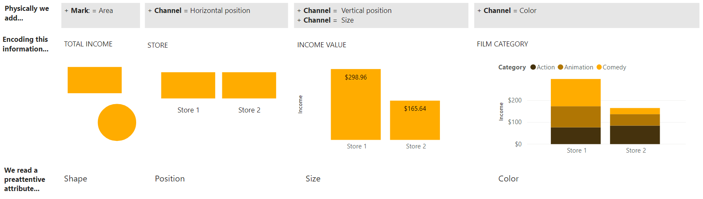

| [Previous](./01-DV-Type-Data.md) | [Back to Agenda](./DataViz_Index.md)  | [Next](./03-DV-Use-Color.md) |
| :---------|:----------:|---------: |

# Data Visualization Fundamentals | (2) Encode data

In this chapter, we will review:
- Use of marks and channels
- Preattentive attributes
  
## Marks and channels

  *Marks are basic geometric elements that represent items and the channels control their appearance*. Together, they are the building blocks to encode data into visual representations.

  - A **mark** is a basic geometrical graphical element. These are the visual placeholders representing **data items**.
    - A zero-dimensional (0D) mark = a **point**.
    - A one-dimensional (1D) mark = a **line**.
    - A two-dimensional (2D) mark = an **area**.

Image by Munzner T. from book "Visualization Analysis and Design". <i>See References for more details</i>.
 

  - A **channel** is way to control the appearance of a mark in order to encode the **value of each data item** as an **attribute** of a mark. Depending on the type of mark, it is possible to modify its:
    - Position
    - Color
    - Shape
    - Tilt
    - Size
  

Table by Kirk A. from book "Data Visualisation: A Handbook for Data Driven Design". <i>See References for more details</i>.

&nbsp;

To understand **how to use these marks and channels** to create effective and powerful visualizations, it is important to understand **how people remember and interact with what they see**.

**How we see?**
When light reflects on surfaces, it creates an stimulus on the eyes and it is processed by the brain. This process is known as **visual perception**.

**What do we remember from what we perceive?**
The brain has 3 types of memory:
- **Iconic memory** is very fast, even unconscious. Is the ability to pick up differences in our environment. Information remains here for a fraction of a second before it is sent to the short-term memory. This type of memory **is tuned to a set of preattentive attributes**.
- **Short-term memory** has **limitations on the capacity of information** that can hold. This is why it is very important to **reduce the cognitive load** of a visualization to avoid people having to go back and forward to process the content. After short-term memory, information may go to oblivion or the long-term memory.
- **Long-term memory** is the aggregate of visual and verbal memory built up over a lifetime.

## Preattentive attributes
Some visual **attributes can be used to impact directly the iconic memory** to highlight information and communicate more effectively. 
Some attributes have a higher impact on the brain than others:

Each attribute may be expanded into detailed visual chracteristics:

Image by Few S. from article "Tapping the Power of Visual Perception". <i>See References for more details</i>.
 

>In this way, when **using a mark** in a visualization and **adding channels** to modify its visual characteristics to encode data, **the brain perceives a specific preattentive attribute**.

## Encoding data in a visualization step by step
<table>
<thead>
  <tr>
    <th>Encoding data step by step</th>
  </tr>
</thead>
<tbody>
  <tr>
    <td></td>
  </tr>
  <tr>
    <td>In the first step, we physically add an area mark as a placeholder for the data item that we want to represent which is the total income in this case. The brain perceives a shape as the preattentive attribute. </td>
  </tr>
  <tr>
    <td></td>
  </tr>
  <tr>
    <td>Then we want to modify this mark that is representing the total income so we can encode the information related to the stores. To do this, we use the horizontal position channel. Now, the most-left position is the Store 1 and the most-right position is the Store 2. The brain perceives very quickly the position attribute as it is the most impacting attribute for the iconic memory.</td>
  </tr>
  <tr>
    <td></td>
  </tr>
  <tr>
    <td>Now we want to encode the quantitative value of the income. To do this we modify the mark by adding two new channels: The vertical position channel which defines the zero value as the most inferior position and the size channel that gives a numerical meaning for the sizes of the shapes. Now the brain identifies a difference between the size attributes of the two blocks.</td>
  </tr>
  <tr>
    <td></td>
  </tr>
  <tr>
    <td>Finally, we want to encode the film category into the visualization. To do this, we add a channel that hasn't been used: color. In this case, we use different hues to distinguish between the categorical values of this variable. To facilitate the identification, we also add a label to clarify the relationship between the hue and the film category. Now the brain identifies that the color attribute is changing.</td>
  </tr>
</tbody>
</table>

&nbsp;

| [Previous](./01-DV-Type-Data.md) | [Back to Agenda](./DataViz_Index.md)  | [Next](./03-DV-Use-Color.md) |
| :---------|:----------:|---------: |

