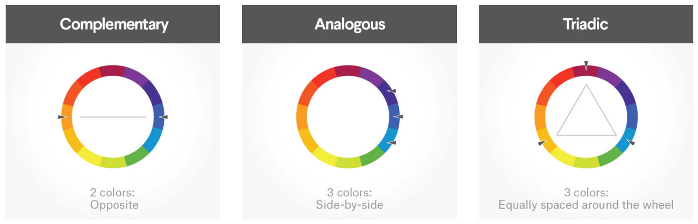
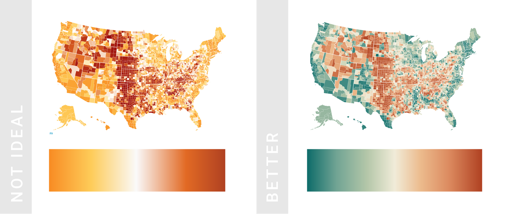

| [Previous](./02-DV-Encode-Data.md) | [Back to Agenda](./DataViz_Index.md)  | [Next](./04-DV-Design-Principles.md) |
| :---------|:----------:|---------: |

# Data Visualization Fundamentals | (3) Use of color

In this chapter, we will review:
- Chromatic circle
- Color classification
- Combination of colors

> Color is a very potent visual stimulus so it will impact inmediately on the viewer: **a variation in color implies significance**.

Color theory is a very vast topic so we will review only some fundamentals concepts that can help to choose the colors for a chart.

## Chromatic circle

  It is a circular diagram of colors developed by Isaac Newton in 1666. It organizes in a visual form the different **types of colors** and facilitates the **creation of harmonies to combine** them.

<table>
<thead>
  <tr>
    <th colspan="2">Chromatic circle</th>
  </tr>
</thead>
<tbody>
  <tr>
    <td colspan="2">
    

      Image obtained from Amazon article "Student Color Wheel". <i>See References for more details</i>.
    

    </td>
  </tr>
  <tr>
    <td colspan="2">The chromatic circle is a powerful tool to <b>identify color types and harmonies</b>. Besides, if we <b>draw a line through the center of the wheel</b>, we can separate the warm and cool colors.</td>
  </tr>
  <tr>
    <td></td>
    <td></td>
  </tr>
  <tr>
    <td><b>Warm colors</b> are generally associated with energy, brightness and action.</td>
    <td><b>Cool colors</b> are generally associated with calm, peace and serenity.</td>
  </tr>
  <tr>
  <td colspan="2">
   <b>Warm colors in combination with shades of blue are commonly used</b> in data visualization. There are several combinations of <b>yellow, orange and red that look pleasant together and still are perceived as different</b> colors. <b>Blue is the complementary color for this group and is more flexible than any hue</b> because there many shades of blue that look pleasing and professional. Besides, colorblind people can easily distinguish blue and orange/red from each other which makes it an accessible palette.

  <b>Green and purple are not commonly used</b> and when they are, is <b>not usually in their pure hue</b> but instead with different lightness and saturation.
  
  </td>
  </tr>
</tbody>
</table>

      Images by Decker K. from blog article "The fundamentals of understanding color theory". <i>See References for more details</i>.

## Color classification

      Image obtained from blog article "The Psychology of Color in Branding You Should Know". <i>See References for more details</i>.

The are 3 categories of colors based on the color wheel:
- **Primary colors**: *Red, Yellow and Blue*. In the **traditional color theory***, these are the 3 pigment colors that can not be mixed or formed by any combination of colors.
- **Secondary colors**: *Green, Orange and Purple*. These are the colors formed by mixing the primary colors. In the color wheel, they are located between the primary colors that produce them.
- **Tertiary colors**: *Yellow-orange, Red-orange, Red-purple, Blue-purple, Blue-green and Yellow-green*. These are the colors formed by mixing a primary and a secondary color. 

***Traditional color theory** refers to the **substractive color model and is the one that most people are more familiar with because is what we learned in school** when mixing paints but it is not the only one. 

>For more information on <b>Color Models</b> see <b>Next Steps</b> section.

## Combination of colors

Using different **figures and locations in the color wheel**, it is possible to identify different color schemes that create a **pleasing arrangement of colors** known as **color harmony**. 

Some of the most used color combinations are: complementary, monochromatic, analogous, triadic, split complementary, tetradic or square.

<table>
<thead>
  <tr>
    <th colspan="2">Color harmonies</th>
  </tr>
</thead>
<tbody>
  <tr>
    <td colspan="2" rowspan="2">
      

      Image by Decker K. from blog article "The fundamentals of understanding color theory". <i>See References for more details</i>.
    

    </td>
  </tr>
  <tr>
  </tr>
</tbody>
</table>

## Color palettes

When selecting **colors for charts and graphs, we must consider the type of data that is presenting**.
- **Categorical** data may be represented with different and contrasting hues which are known as **categorical or qualitative color palettes**. The goal, in this case, is to **distinguish** different categories. **Complementary colors** and **circular color systems** (evenly-spaced colors in the color wheel) are very common harmony options for this case.

      Image by Rost L. from blog article "What to consider when choosing colors for data visualization". <i>See References for more details</i>.

  
- **Quantitative** data may be represented with a **sequential or a divergent color palette**. The goal of this case is to **show variations of a quantitative variable**.
  - Use the **sequential palette** when **there are no antagonists** or opposite values to contrast but just a range of values. e.g. all positive numbers. This palette usually varies between two colors with the same hue and changing only the saturation or the luminosity.

      Image by Rost L. from blog article "What to consider when choosing colors for data visualization". <i>See References for more details</i>.

      Image by Rost L. from blog article "What to consider when choosing colors for data visualization". <i>See References for more details</i>.

  - Use the **divergent palette** when **there are antagonists** or opposite values and a central value around which date is compared (tipically zero) e.g. negative and positive numbers. This palette usually ranges between two or more colors with different hues.
  

      Image by Rost L. from blog article "What to consider when choosing colors for data visualization". <i>See References for more details</i>.

> For **more considerations when choosing colors for data visualization**, please review the **Next Steps** section where you will find more information about this topic as well as some **useful tools** to create color harmonies.
  
&nbsp;

| [Previous](./02-DV-Encode-Data.md) | [Back to Agenda](./DataViz_Index.md)  | [Next](./04-DV-Design-Principles.md) |
| :---------|:----------:|---------: |

