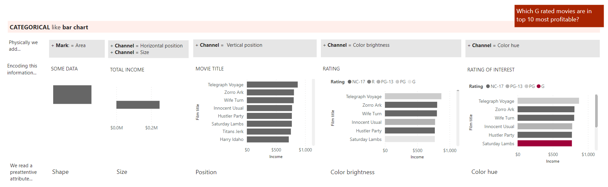
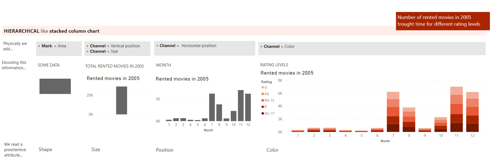

| [Previous](./04-DV-Design-Principles.md) | [Back to Agenda](./DataViz_Index.md)  | [Next](./NextSteps.md)  |
| :---------|:----------:|---------: |

# Data Visualization Fundamentals | (5) Types of charts

In this chapter, we will review:
  - Chart families
  - Process of construction of representative charts
  
## Chart families
If the marks and attributes are the ingredients to build a visualization, chart types are the recipes. Different charts offer different established ways of representing data, each one comprising combinations of marks and attributes.

There are many chart-type options. The following division into 5 main families was proposed by Andy Kirk based on the primary relationship that is represented in the chart in order to facilitate the selection of a type of chart.

**"CHRTS" Families of Chart Types:**

  #### CATEGORICAL
  - Objective: **Compare categories and distributions of quantitative values**.
  - Charts: **bar chart**, clustered bar chart, bullet chart, **waterfall chart**, radar chart, polar chart, pictogram, **heat map**, matrix chart, dot plot, **histogram**, box-and-whisper plot.
  
  #### HIERARCHICAL
  - Objective: **Reveal part-to-whole relationship and hierarchies**.
  - Charts: **pie chart**, **stacked bar chart**, diverging bar chart, treemap, venn diagram.

  #### RELATIONAL
  - Objective: **Explore correlations and connections**.
  - Charts: **scatter plot**, bubble plot.

  #### TEMPORAL
  - Objective: **Plot trends ans intervals over time**.
  - Charts: **line chart**, slope graph (parallel coordinates), **area chart**, stacked area chart.

  #### SPATIAL
  - Objective: **Mapping spatial patterns through overlays and distortions**.
  - Charts: choropleth map, **contour map**, dot map, flow map, grid map.

## Process of construction of representative charts

<table>
<thead>
  <tr>
    <th>Step by step example for CATEGORICAL family: Horizontal bar chart</th>
  </tr>
</thead>
<tbody>
  <tr>
    <td></td>
  </tr>
</tbody>
</table>

&nbsp;

<table>
<thead>
  <tr>
    <th>Step by step example for HIERARCHICAL family: Stacked column chart</th>
  </tr>
</thead>
<tbody>
  <tr>
    <td></td>
  </tr>
</tbody>
</table>

&nbsp;

<table>
<thead>
  <tr>
    <th>Step by step example for RELATIONAL family: Scatter Plot</th>
  </tr>
</thead>
<tbody>
  <tr>
    <td>
    
    </td>
</tbody>
</table>

>For more information on <b>what visualization to use based on data types</b> see <b>Next Steps</b> section.

&nbsp;

| [Previous](./04-DV-Design-Principles.md) | [Back to Agenda](./DataViz_Index.md)  | [Next](./NextSteps.md) |
| :---------|:----------:|---------: |

