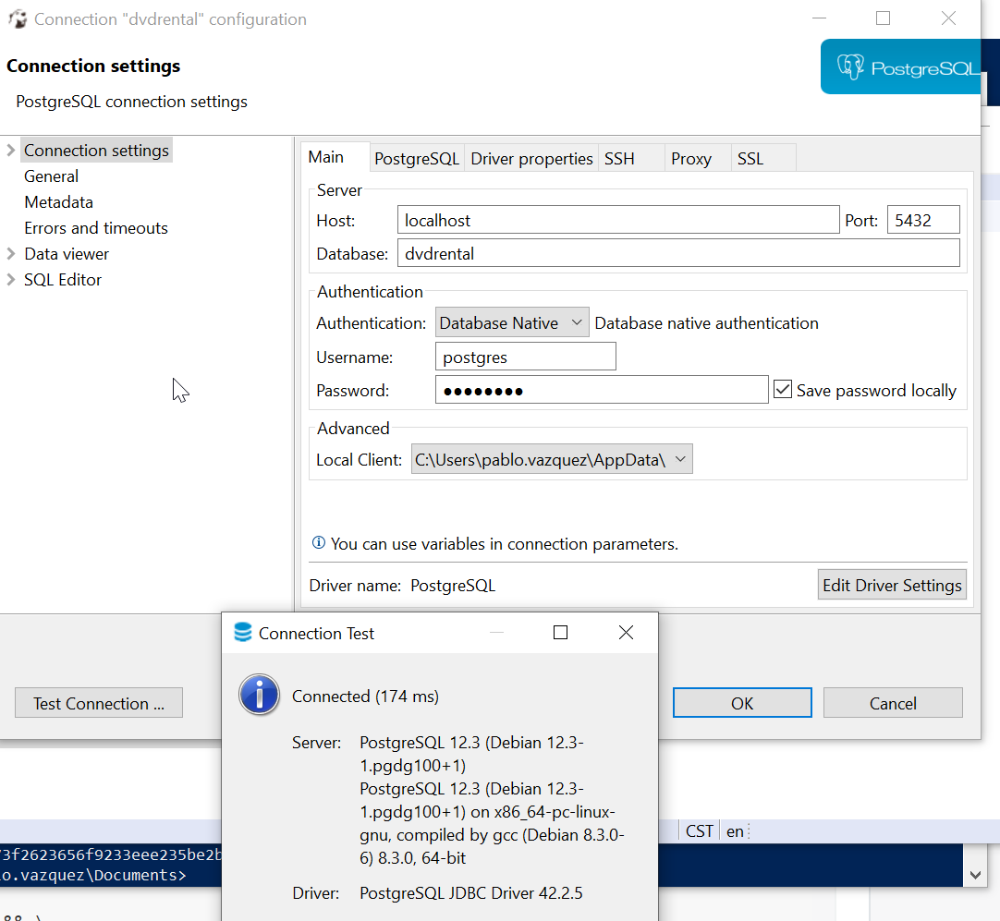
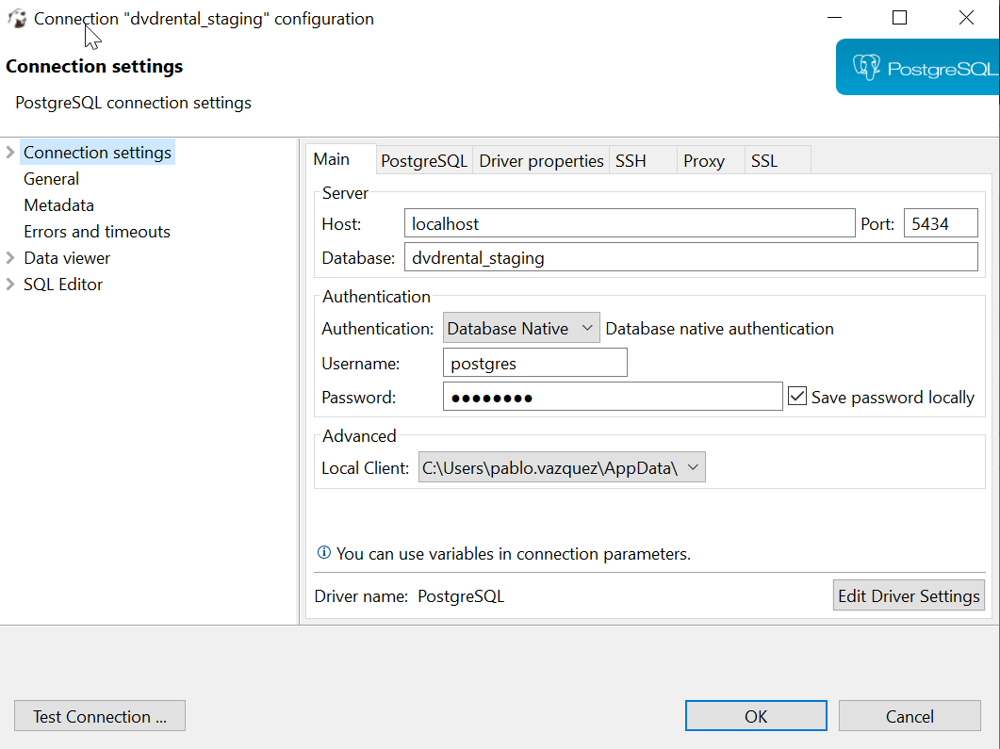
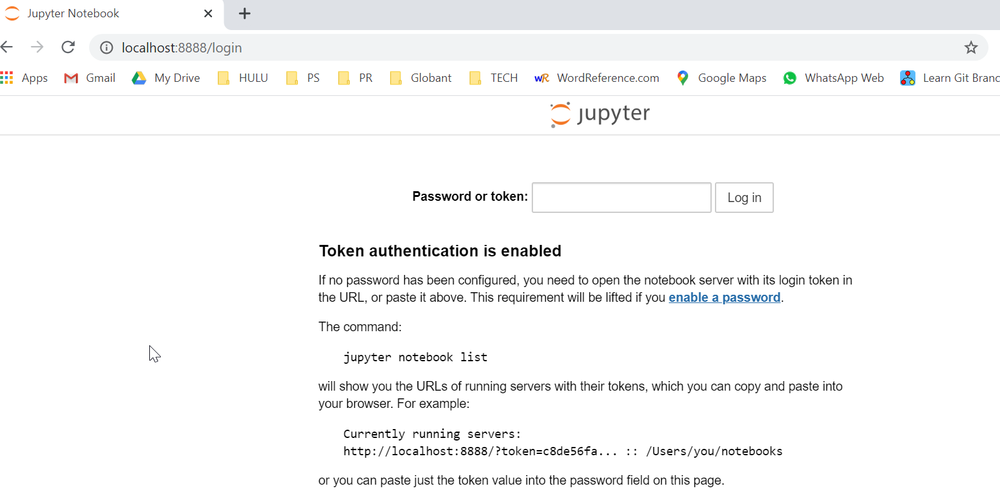
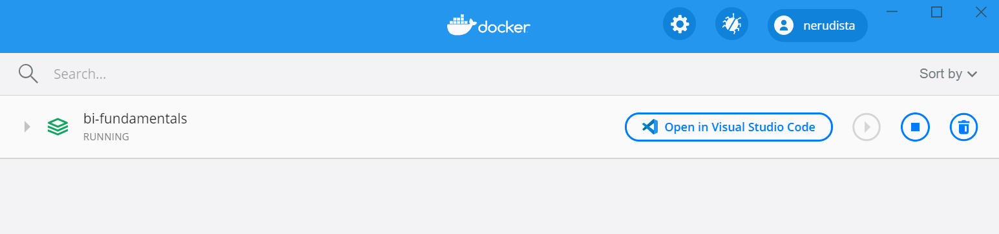
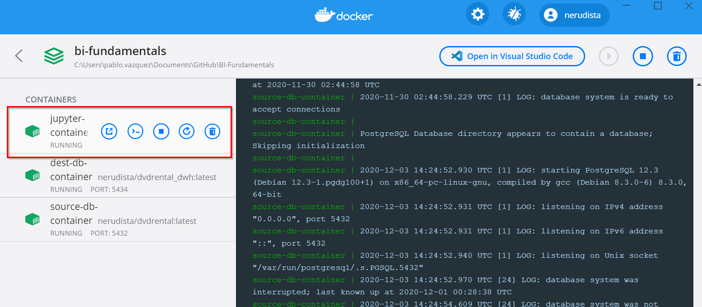
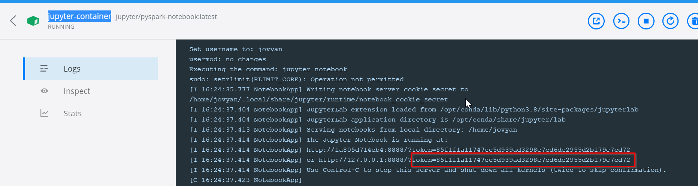

| [Back to Course Material](./README.md)  | [Next](./Install_Pentaho.md) |
| :---------|---------: |

# Install Dockerized Databases 

 ## Instructions

1. Install Docker Desktop
Use link:   [https://www.docker.com/products/docker-desktop](https://www.docker.com/products/docker-desktop)

2. Clone this repo and be sure you are in master branch.

3. Open a terminal/cmd/powershell in the base folder of this repo.

4. To run containers, in your terminal, go to the base folder of this repo. The file `docker-compose.yml` must be present. Then run:

```bash
docker-compose up -d
```

This will run `docker-compose` and the network, containers and volumes will be created.

Please notice:

- Source Database is available in your localhost - port `5432`.
- Staging Database is available in your localhost- port `5434` and DWH Database is **also** available in port `5434`.
- A container with Spark and Jupyter is created. It is availabe in your localhost - port `8888`
- This means that in destination container you have two different databases in the same container.
- Some volumes are created so you don't lose data if containers are stopped.

Once the container is running you have two options:

- Stop the container with `docker-compose stop` .This will stop containers but you can wake them up with `docker-compose start`
- Destroy the containers with `docker-compose down` . This will destroy the network and containers **but will preserve** the volumes. So, if you create the containers with `docker-compose up` you will recover your data. 

5. Install your preferred SQL GUI. These are some options:

- [https://dbeaver.io/](https://dbeaver.io/)
- [http://squirrel-sql.sourceforge.net/](http://squirrel-sql.sourceforge.net/)
- [https://www.mysql.com/products/workbench/](https://www.mysql.com/products/workbench/)

6. Connect your SQL GUI to the Source database. User and pass are the same: `postgres`


7. Do the same for Staging and DWH Databases. User and pass are the same: `postgres`. Names and ports are:

- `dvdrental_staging` and port to `5434`
- `dvdrental_dwh` and port to `5434`





8. The Jupyter container can be reached  [in this link](http://localhost:8888/login) :



The token, requested in the login, is shown in the jupyter-container log. You can see that log if you open your Docker Desktop and click the cluster you created: **bi-fundamentals**




After that the 3 containers will be shown and you need to click on the `jupyter-container`



Finally, the token will appear



| [Back to Course Material](./README.md)  | [Next](./Install_Pentaho.md) |
| :---------|---------: |