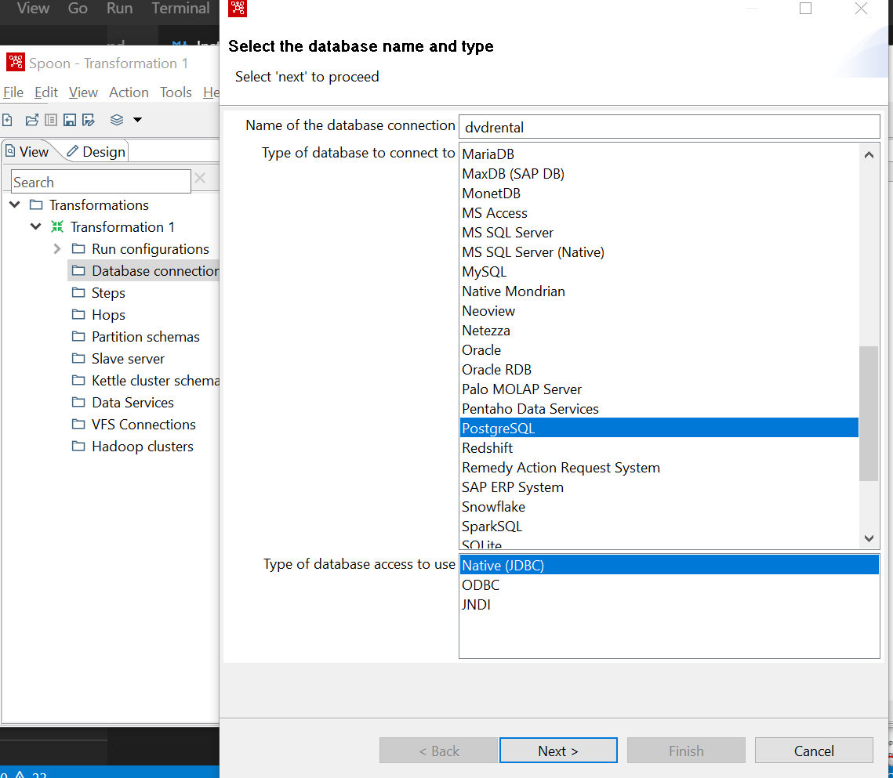

| [Back to Course Material](./README.md)  | [Next](./Course-Material/1-SQL/SQL_Index.md) |
| :---------|---------: |

# Install Pentaho

This step **is completly optional**. It is not necessary for any of the steps in this course but may be useful in case you want to move information between databases, you want to replciate some objects or you want to complete the exercises.

Managing Pentaho will give you good basis for ETL concepts and DWH. 

## Instructions

 **This instructions needs to be done AFTER [Docker cointainer is up and running](./Install_Docker_DB.md). Otherwise, the connection cannot be stablished**

1. Download Pentaho PDI from:
[https://sourceforge.net/projects/pentaho/](https://sourceforge.net/projects/pentaho/)

2. Extract the `pdi-ce-9.xxx.zip` file in the base folder of your local repository.

It should look like this:

3. Download Java 1.8

[https://www.oracle.com/java/technologies/javase/javase-jdk8-downloads.html](https://www.oracle.com/java/technologies/javase/javase-jdk8-downloads.html)

Use the appropiate version for your machine. In my case is Windows x64.

4. Install the JDK

5. Create the system variable `JAVA_HOME` with the value where the Java was installed. It should be prompted during installation:

6. Modify `PATH` variable to include the fresh Java

7. Look for file `spoon.bat` inside `data-integration` folder and double click on it.

The GUI should be open:

8. Configure connection to all three Postgres databases. 

This are the steps for one connection. 

Complete the other two connections.

| [Back to Course Material](./README.md)  | [Next](./Course-Material/1-SQL/SQL_Index.md) |
| :---------|---------: |